
<h1 align="center">基于BS的超市商品管理系统的设计与实现+vue</h1>

## 简介
超市商品管理系统：角色分为管理员、销售员工，功能涵盖商品信息管理、采购及销售管理、供应商管理、销售数据统计等，为高效库存及供应链管理提供支持。    --计算机毕业设计源码；毕设源码；java毕业设计源码

## 联系方式

<h3 align="center">获取完整代码与数据库文件 + 微信：deepguan QQ: 86050149 QQ群: 783742310</h3>

<h3 align="center">可帮忙远程部署 包运行成功！提供远程部署、修改代码、设计文档指导、代码讲解等服务！</h3>

## 功能介绍（完整见运行截图）
管理员： 管理员可以通过登录系统访问不同模块，包括商品、销售、采购、供应商和基础数据管理等操作。提供商品信息录入与管理，支持商品详细查看、修改、删除和库存管理。管理员还可以查看和分析销售数据，通过柱状图展示不同员工和商品的销售业绩。界面提供采购进货管理，允许对采购信息以及供应商信息进行管理、查询和操作。管理员能够管理和维护员工信息，通过导航栏快速切换不同功能，以实现高效的超市商品管理。

员工： 销售员工和采购员工在此系统可以登录他们的个人账号，并访问与其角色相关的模块。销售员工能够查看销售数据，录入销售信息，并通过图表了解个人及其他员工的销售表现。采购员工负责录入和管理采购信息，选择供应商和商品，填写并维护采购记录。系统还为员工提供个人信息查看和修改，注重操作方便性和数据准确性，以提高员工工作效率。整体设计确保员工能够轻松管理各自职责下的商品和数据。

供应商： 供应商模块提供了一个专门的渠道来管理和维护与供应商的业务信息。管理员或授权员工可以查看和编辑供应商列表，包括供应商名称、类型及信用等级。支持按条件筛选和查找供应商信息，还可以进行添加、修改、删除以及查看详细信息操作。 此功能以优化供应链关系，确保采购流程顺畅和供应商评估更加高效可信，提供动态更新的能力以适应合作需求。

用户： 用户主要是指超市商品管理中的最终客户，虽然系统主要为后端管理提供服务，但通过该系统的用户角色一些基本功能同样适用于员工或管理员的使用，如个人中心功能，允许用户查看和编辑个人信息，进行角色关联的权限设定与整合。用户体验友好，界面设计简洁并且导航清晰，有助于在操作中减少误差，提高个人信息与权限管理的便利性。

## 运行截图
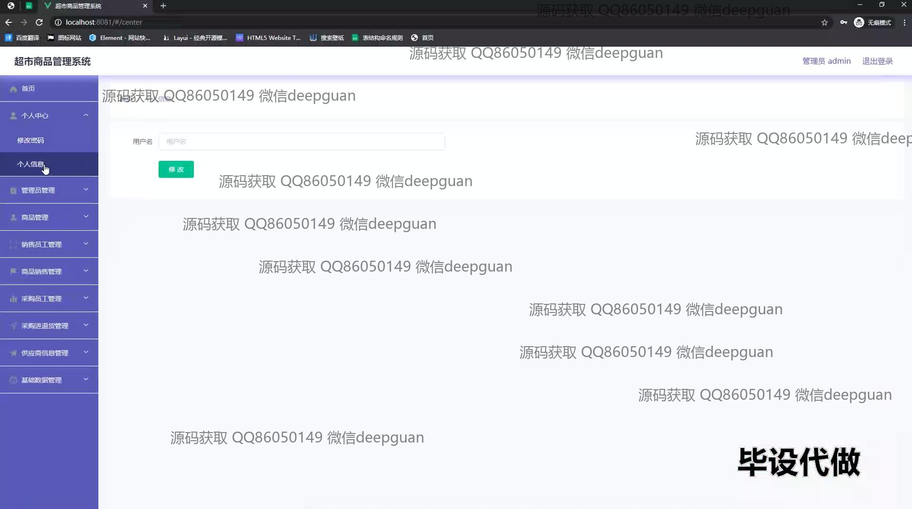
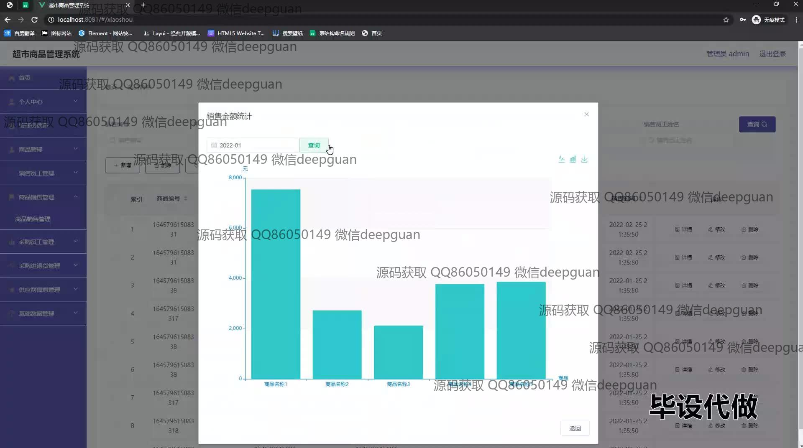
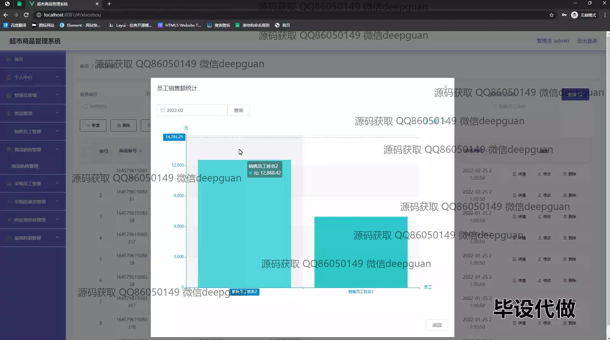
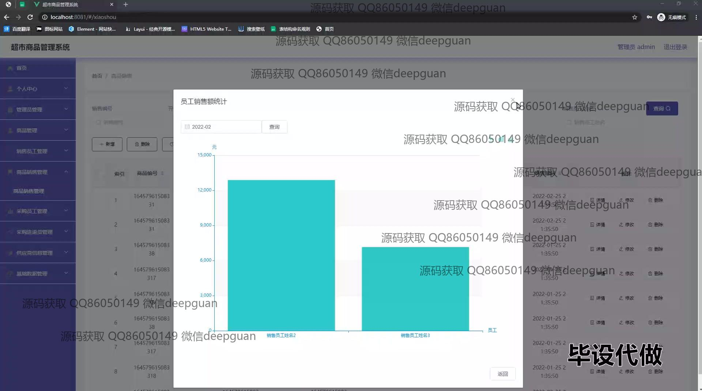
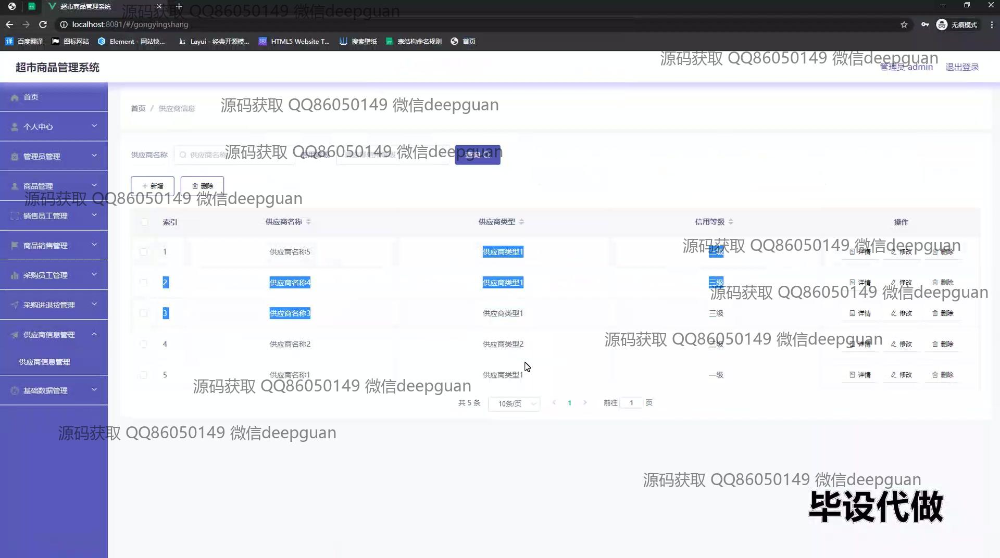
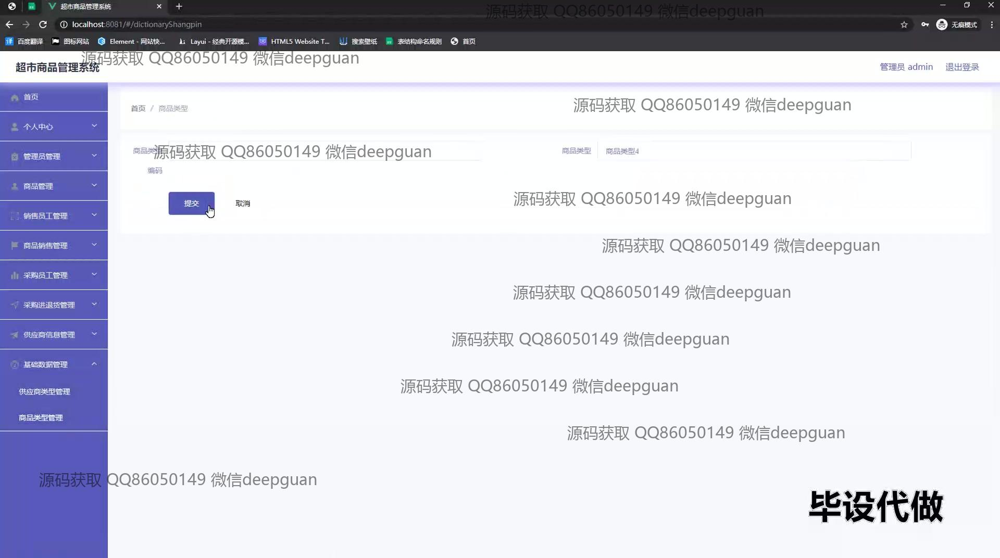
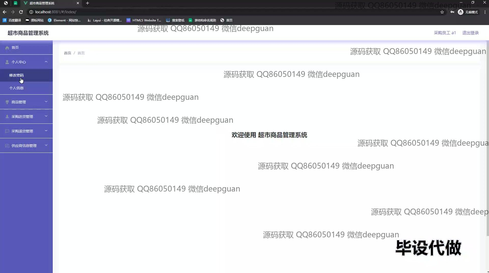
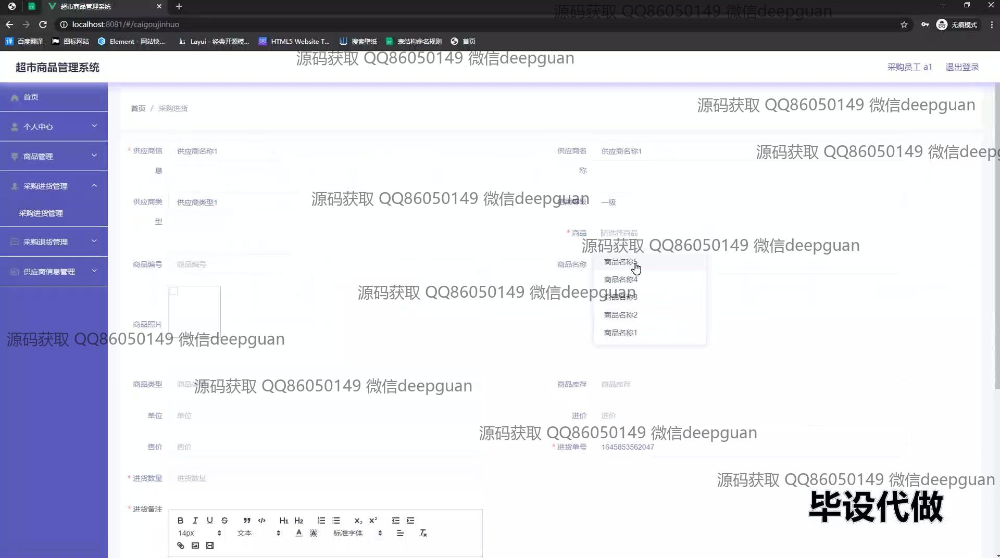
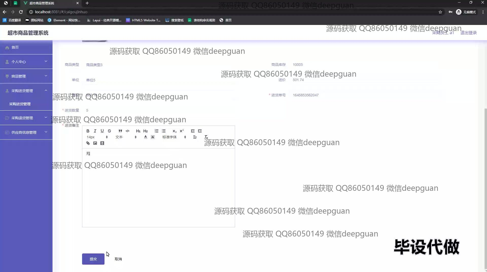
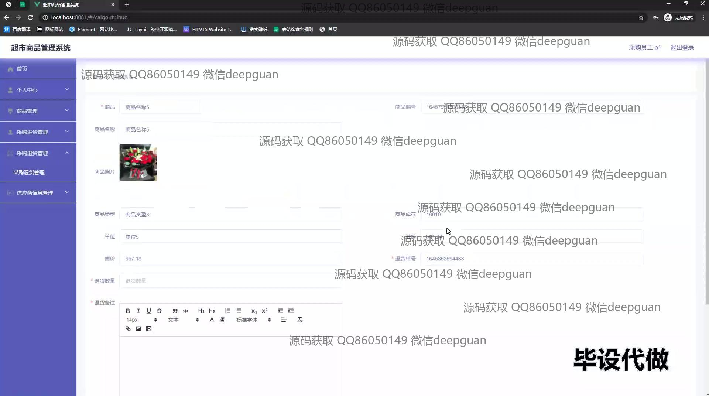
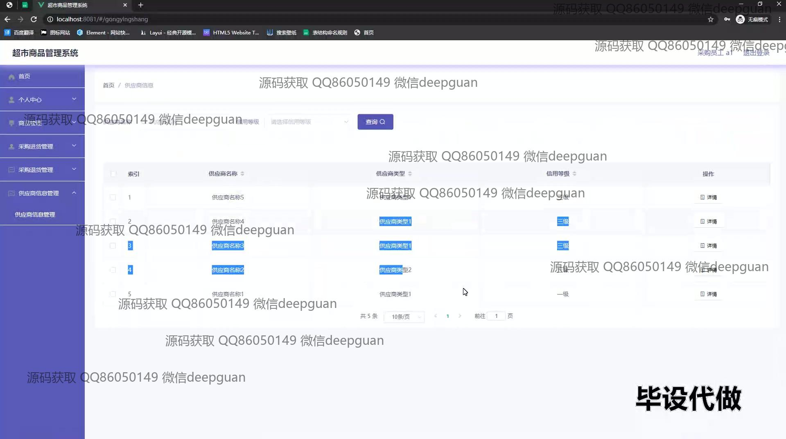
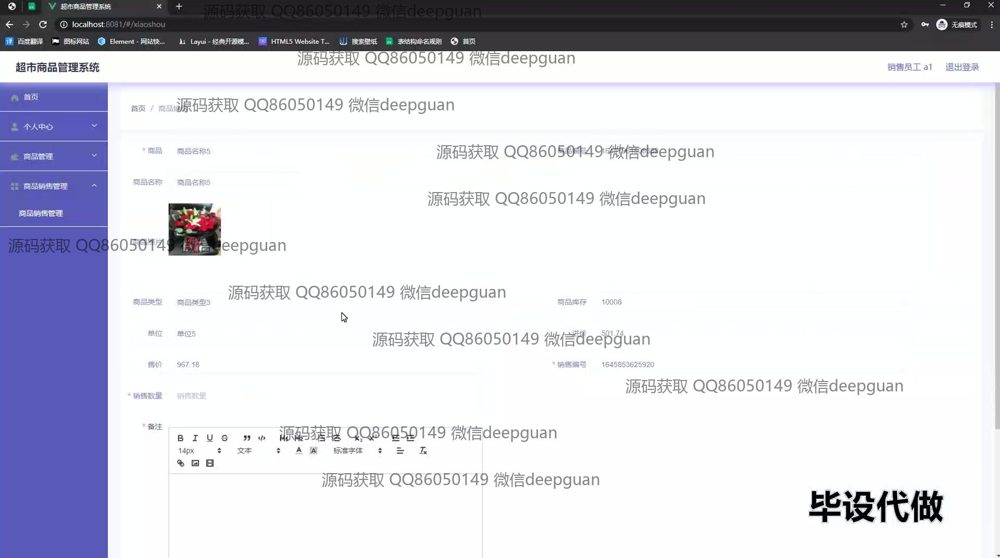
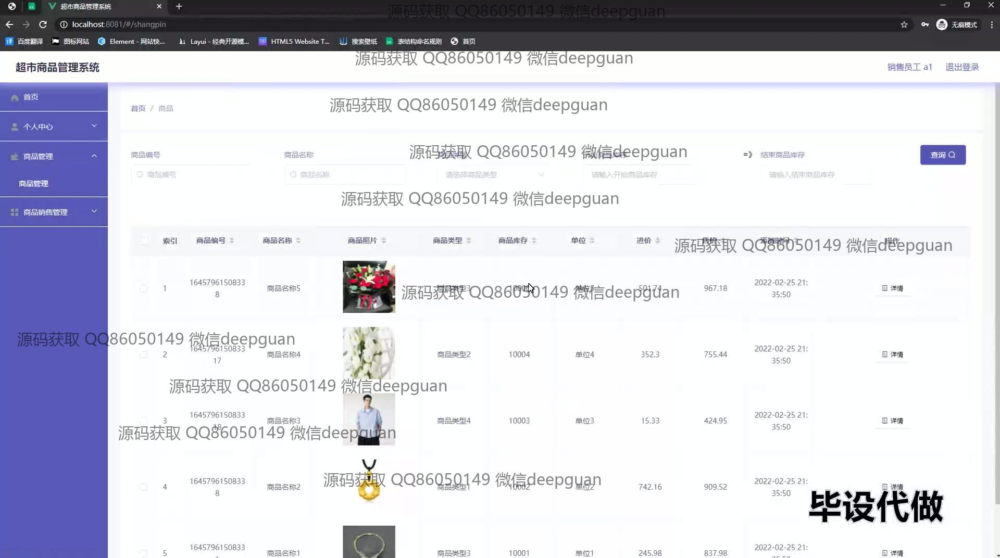

本代码来源于网络,仅供学习参考使用!

